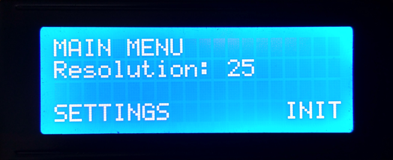

# Spin 360

Get a ' _360 photography _' - also known as ' _360 spin_ ', ' _360 view_ ', ' _Spin Photography_ ' or ' _Product Spin_ ' - with a photographic technique by which a series of photos are taken of an object as it rotates one full revolution.

The purpose of **_Spin 360_** is to automate the process of obtaining the pictures, rotating a platform and shooting a camera in each platform position. In this way you will only need to choose the number of pictures that you desire and this project will do all the work.

## How it works

**Click Button:** _Right Option_  
**Hold Button:** _Left Option_  
**Turn Enconder:** _Change value / Navigate_

## Hardware Requirements

* Arduino
* Bipolar Stepper Motor
* L298N Motor Drive Controller
* LCD 20x4 Display with I2C Serial Interface Board
* Relay Module
* Rotary Enconder
* Switch

## Dependencies

> LiquidCrystal_I2C only is compatible with the Arduino 1.6.5 IDE Release, don't work in newest releases.

**_Spin 360_** needs in addition to the libraries which come installed with the [Arduino IDE](https://www.arduino.cc/en/Main/Software), another library for working with the LCD Display connected to I2C:
*  [LiquidCrystal_I2C](https://github.com/marcoschwartz/LiquidCrystal_I2C) by @marcoschwartz ,you can find it with the _Library Manager_ of the  _Arduino IDE_

## Arduino Schematic

# Applications

## 3D reconstruction

3D reconstruction is the creation of three-dimensional models from a set of images. It is the reverse process of obtaining 2D images from 3D scenes.

[VisualSFM](http://ccwu.me/vsfm/) is a very known software used to extract 3D models from images sequences, although there are other commercial alternatives.

## Online Sales

Increase your sales using this technique for commercial purposes.

Software is used to compose these individual images into an interactive 360 display that supports drag/swipe to move the object to the left/right and also up/down in the case of multi-axis spins. This causes the visual appearance of a fluidly rotating object.
